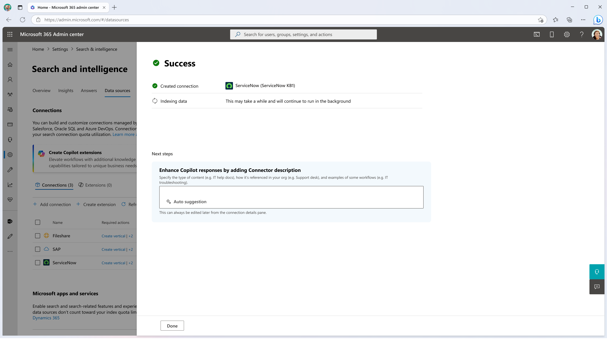

<!-- markdownlint-disable no-trailing-punctuation -->

# Set up Microsoft Graph connectors in the Microsoft 365 admin center

This article outlines the steps to set up a Microsoft Graph connector in the Microsoft 365 admin center. The setup process is streamlined, with minimal inputs that simplify connection creation. However, you can opt for a custom setup to fine-tune specific settings.

> [!NOTE]
> The setup process is similar for all the Microsoft Graph connectors but isn't exactly the same. In addition to reading this article, be sure to read the connector-specific information for your data source.

> [!NOTE]
> You can add a maximum of thirty (30) Microsoft Graph connections to each tenant.

> [!TIP]
> **Product survey**
> 
> To help us understand your requirements related to connecting more data sources to Copilot or Microsoft Search, we request you to take few minutes to fill out this [survey form](https://forms.office.com/r/0Hh4GJNsJe). Based on the survey results, Microsoft will build connectors for the top demanded data sources.

## Prerequisites

Before you begin, ensure the following:

- **Admin Access:** You must have either of the following roles in Microsoft 365 admin center to configure a Graph connector - Global admin, Search admin, or Copilot admin.
- **Data Source Credentials:** Collect the necessary credentials and permissions for the data source you want to connect.
- **Service Account (if applicable):** If your data source requires a service account, ensure it has the necessary roles or permissions.

---
## Step 1: Add a Microsoft Graph Connector
Complete the following steps to configure any of the Microsoft Graph connectors (or [click here](https://admin.microsoft.com/adminportal/home#/MicrosoftSearch/Connectors/add?ms_search_referrer=MicrosoftSearchDocs_Configure_Connector) to directly access the Connector Catalog):

> [!div class="mx-imgBorder"]
   > 

1. **Open the Microsoft 365 Admin Center:**
   - Sign in to the [Microsoft 365 admin center](https://admin.microsoft.com/).

2. Navigate to Settings:
   - In the left-hand navigation pane, select **Settings**.
   - Click on **Search & intelligence**.

3. Add a New Data Source:
   - Go to the [**Data sources** tab](https://admin.microsoft.com/Adminportal/Home#/MicrosoftSearch/Connectors).
   - Click on [+Add](https://admin.microsoft.com/adminportal/home#/MicrosoftSearch/Connectors/add?ms_search_referrer=MicrosoftSearchDocs_Configure_Connector).
   - From the list of available connectors, select the data source you wish to connect (for example, ServiceNow Knowledge, or Salesforce).

---

## Step 2: Enter Basic Connection Details

(media/servicenow-knowledge-create-page.png#lightbox)

1. **Display Name:**
   - To help users recognize the source in Copilot and search results, enter a name to identify the connector.
   - A default name is provided, but you can customize it to suit your organization's needs.

2. **Data Source URL:**
   - Provide the URL of your data source. For example, if you’re connecting to ServiceNow, the URL might look like `https://your-organization-name.service-now.com`.

3. **Authentication Type:**
   - Choose an authentication method to access the data source.

4. **Rollout to limited audience**
   - Initially, you can deploy the connector to a subset of users for validation in Copilot and other search surfaces. This feature allows you to test the integration before broader rollout.

---

> [!NOTE]
> For most connectors, default settings are optimized for the data source. These settings include access permissions, schema, and sync frequency. If you want to edit any of these settings, you need to choose the ["Custom Setup"](#custom-setup-optional) option.

## Step 3: Create the Connection

- Click **Create** to set up the connection. The connector begins indexing content from your data source using default settings.

Once the connection is created, you can add a description for the connection in the success screen. To help Copilot enhance connection results for users, the description should answer the following questions briefly:  
* What kind of content does this connection have? 
* How do users refer to this content source in their respective orgs? 
* What part of the workflow do users refer to this content in their day-to-day work? 
* What are some characteristics of the content?

To learn more, refer to the [Enhancing Microsoft Copilot discovery with Graph Connector Content](enhancing-microsoft-copilot-discovery-with-graph-connector-content.md) article.

---

## Custom Setup (Optional)

Admins who want more control over the configuration can choose the **Custom Setup** option. This option provides access to three tabs for detailed settings: **Users**, **Content**, and **Sync**.

### Users

1. **Access Permissions:**
   - Choose whether indexed data is visible to:
     - **Everyone** in the organization.
     - **Only people with access to content in the data source.**

2. **Map Identities:**
   - By default, users are mapped by checking whether their email in the data source matches with a `UserPrincipalName` or  `Mail` in Microsoft Entra ID.
   - If this default doesn’t work for your organization, provide a custom mapping formula.

---

### Content

1. **Manage Properties:**
   - Configure properties from the data source, such as making them searchable, queryable, or refinable.
   - Assign semantic labels and aliases to enhance search relevance.

   For more information on Manage Properties, see [below](#guidelines-for-manage-properties).
---

### Sync

**Refresh Intervals:**
   - Configure the frequency of data syncs between the data source and the Graph connector index.
     - **Full Crawl:** Synchronizes all data at scheduled intervals.
     - **Incremental Crawl:** Updates only the changed or new data.
   - Adjust the default sync settings as required for your organization.
   
      For more information on Sync settings, see [below](#guidelines-for-sync-settings).
---

## More Resources

### Guidelines for 'Manage Properties'

#### Content property

We recommend that you select a **Content Property** from the drop-down menu of options, or keep the default if one is present. This property is used for full-text indexing of content, search results page snippet generation, [result cluster](result-cluster.md) participation, language detection, HTML/text support, ranking and relevance, and query formulation.

If you select a content property, you have the option of using the system-generated property **ResultSnippet** when you [create your result type](customize-results-layout.md). This property serves as a placeholder for the dynamic snippets that are generated from the content property at query time. If you use this property in your result type, snippets are generated in your search results.

#### Aliases for source properties

You can add aliases to your properties under the "Alias" column. Aliases are friendly names for your properties. They're used in queries and in the creation of filters. They're also used to normalize source properties from multiple connections such that they have the same name. That way you can create a single filter for a vertical with multiple connections. For more information, see [Customize the search results page](customize-search-page.md).

#### Semantic labels for source properties
You can assign semantic labels to your source properties. Labels are well-known tags provided by Microsoft that provide semantic meaning. They allow Microsoft to integrate your connector data into Microsoft 365 experiences such as Copilot, enhanced search, people cards, intelligent discovery, and more.  

The following table lists the currently supported labels and their descriptions.  

Label | Description
--- | ---  
**title** | The title for the item that you want shown in search and other experiences
**url** | The target URL of the item in the source system
**Created By** | Name of the person who created the item
**Last modified by** | Name of the person who most recently edited the item
**Authors** | Name of the people who participated/collaborated on the item
**Created date time** | Time when the item was created
**Last modified date time** | Time when the item was most recently edited
**File name** | Name of the file item
**File extension** | Type of file item such as pdf or doc

The properties on this page are pre-selected based on your data source, but you can change this selection if there's a different property that is better suited for a particular label.  

The label **title** is the most important label. We *strongly recommend* that you have a property assigned to this label for your connection to participate in the [result cluster experience](result-cluster.md).

Incorrectly mapping labels causes a deteriorated search experience. It's okay for some labels to not have a property assigned to it.  

#### Search schema attributes

You can set the search schema attributes to control the search functionality of each source property. A search schema helps determine what results display on the search results page and what information end users can view and access.

Search schema attributes include options to **Query**, **Search**, **Retrieve**, and **Refine**. The following table lists each of the attributes that Microsoft Graph connectors support and explains their functions.

Search schema attribute | Function | Example
--- | --- | ---
SEARCH | Makes the text content of a property searchable. Property contents are included in the full-text index. | If the property is **title**, a query for **Enterprise** returns answers that contain the word **Enterprise** in any text or title.
QUERY | Searches by query for a match for a particular property. The property name can then be specified in the query either programmatically or verbatim. |  If the **Title** property can be queried, then the query **Title: Enterprise** is supported.
RETRIEVE | Only retrievable properties can be used in the result type and displayed in the search result. |
REFINE | The refine option can be used as on the Microsoft Search results page. | Users in your organization can [filter](custom-filters.md) by **URL** on the search results page if the refine property is marked during connection setup.

For all connectors except the File share connector, custom types must be set manually. To activate search capabilities for each field, you need a search schema mapped to a list of properties. The connection configuration assistant automatically selects a search schema based on the set of source properties you choose. You can modify this schema by selecting the check boxes for each property and attribute on the search schema page.

:::image type="content" alt-text="Screenshot that shows schema for a connector can be customized by adding or removing Query, Search, and Retrieve functions." source="media/manageschema.png" lightbox="media/manageschema.png":::

#### Restrictions and recommendations for search schema settings

* The **content** property is searchable only. After you select it in the dropdown, this property can't be used with the options **retrieve** or **query**.

* Significant performance issues occur when search results render with the **content** property. An example is the **Text** content field for a [ServiceNow](https://www.servicenow.com) knowledge-base article.

* Only properties marked as retrievable render in the search results and can be used to create modern result types (MRTs).

* Only string properties can be marked searchable.

> [!NOTE]
> To update the schema after creating a connection, refer [manage search schema](manage-search-schema.md) article.

### Guidelines for Sync settings

The refresh interval determines how often your data is synced between the data source and Microsoft Search. Each type of data source has a different set of optimal refresh schedules based on how often data is modified and the type of modifications.

There are two types of refresh intervals, **Full refresh** and **Incremental refresh**, but incremental refreshes aren't available for some data sources.

With a full refresh, the search engine processes and indexes the items that have changed in the content source, regardless of previous crawls. A full refresh works best for these situations:

* Detecting deletions of data.
* The incremental refresh found errors, and failed.
* ACLs (Access Control Lists) were modified.
* Crawl rules were modified.
* The schema for the connection was updated.

With an **Incremental refresh**, the search engine can process and index only the items that were created or modified since the last successful crawl. As a result, not all the data in the content source is reindexed. Incremental refreshes work best to detect content, metadata, and other updates.

> [!NOTE]
> Incremental crawls don't currently support processing of updates to **permissions**.

Incremental refreshes are faster than full refreshes because unchanged items aren't processed. However, if you choose to run incremental refreshes, you still need to run full refreshes periodically to maintain correct data sync between the content source and the search index.

### Crawl Scheduling

You can configure full and incremental crawls based on the advanced scheduling options present on the Refresh Settings page. Some connectors don't support incremental crawls and the option to configure incremental crawls isn't available for those connectors. For others, the incremental crawl is an optional crawl and enabled by default. A crawl schedule is selected by default for you based on the connector type. This default setting can be changed during connection creation or edited after a connection is published from the "Edit" flow of a connection. You can choose from these fields:

* **Recurrence**: You can choose to run the crawls every day, week, second week or fourth week.
* **Day(s)**: This option is enabled when you choose to run crawls only on specific days of the week.
* Run once a day check box lets you choose the start time of the crawl in a day. If not selected, the crawls repeat in a day by default. You can choose the repeat interval from the dropdown.
* **Frequency**: Select this option if you want to repeat crawls in a day after certain time intervals. The smallest repeat frequency is 15 minutes, and the largest is 12 hours.
* **Starting Time**: Select the time when you want the crawl to start.
* **Reset**: This option resets the schedule to the connector's default schedule.

:::image type="content" alt-text="Screenshot that shows sample configuration setting." source="media/refresh-settings/incremental-week-view.png":::

Here are certain points to note while configuring the crawl schedule:

* If you leave any of the fields empty, or unselected, Graph connectors pick the best time to start a crawl. For example if you choose a crawl Recurrence as "Day" and don't select the start time, Graph connectors choose the time based on your last crawl to start the new crawl. If you don't want to specify a start time of the crawl, it's a good practice to let the connector decide when to start the crawl.
* Even if the start time is mentioned, the crawl start may delay by an hour. This delay can be because of reasons such as network load etc.
* If the previous crawl overruns to the time of the next crawl, we don't stop the ongoing crawl and queue the next crawl. After the ongoing crawl is complete, we run the queued crawl only if it is of a different type (full/incremental) than the previous crawl. For example, if an incremental crawl overruns the next full crawl, we don't suspend the incremental crawl and queue the full crawl. After the completion of the incremental crawl, since the queued crawl is of different type (full), we start the full crawl immediately.

These are some of the scenarios:

* Run incremental crawl daily after every 15 minutes

:::image type="content" alt-text="Screenshot that shows run incremental crawl daily after every 15 minutes." source="media/refresh-settings/incremental-daily-view.png":::

Here selecting the "Run once in a day" checkbox lets you choose the "Start time" to run incremental crawl only once in a day starting at the specified time. However, unselecting it lets you choose the frequency of crawl repetitions in a day. If you want your data to be continuously refreshed, you can choose to run incremental crawls frequently in a day. But if the number of items in data source is large and the crawls tend to be longer, or if frequent updates aren't needed for the content, you can choose the incremental crawl to run once in a day.

:::image type="content" alt-text="Screenshot that shows run incremental crawl daily at 2:00 PM" source="media/refresh-settings/incremental-run-once.png":::

* Run incremental crawl every week on Wednesday, Saturday and Sunday repeating every 15 minutes and starting at 1:00 AM

:::image type="content" alt-text="Screenshot that shows run incremental crawl every week on Wednesday, Saturday and Sunday repeating every 15 minutes and starting at 1:00 AM." source="media/refresh-settings/incremental-week-view.png":::

* Run full crawl every day at 1:00 AM

:::image type="content" alt-text="Screenshot that shows run full crawl every day at 1:00 AM." source="media/refresh-settings/full-day-view.png":::

* Run full crawl every week on Friday at 8:00 PM

:::image type="content" alt-text="Screenshot that shows run full crawl every week on Friday at 8:00 PM." source="media/refresh-settings/full-week-view.png":::

### IP Firewall rules

IP firewall rules are configured to secure access to your data source by allowing only specific IP addresses. In such scenario, permit access to the Graph connectors service IP ranges to allow access to your data source. Specify the following IP ranges in the firewall settings of your SaaS platform.

| Region | Microsoft 365 Enterprise | Microsoft 365 Government
| ------------ | ------------ | ------------ |
| NAM | 52.250.92.252/30, 52.224.250.216/30 | 52.245.230.216/30, 20.141.117.64/30|
| EUR | 20.54.41.208/30, 51.105.159.88/30 | NA|
| APC | 52.139.188.212/30, 20.43.146.44/30 | NA|
