# Enterprise Websites on-premises Microsoft Graph connector

The Enterprise Websites on premises Microsoft Graph connector allows your organization to index webpages and **content from your company-owned websites**. After you configure the connector and index content from the websites, end users can search for that content from in Microsoft Search and Microsoft 365 Copilot.

This article is for Microsoft 365 administrators or anyone who configures, runs, and monitors an Enterprise Websites on-premises Microsoft Graph connector. 

## Capabilities
- Index webpages from on-premises or private cloud hosted websites.
- Index up to 50 websites in a single connection.
- Exclude webpages from crawl using exclusion rules.
- Use [Semantic search in Copilot](semantic-index-for-copilot.md) to enable users to find relevant content.

**Supported file types**

| File Extension | File Type | Description | 
| -------------- | --------- | ----------- |
| .pdf | PDF | Portable Document Format |
| .odt | OpenDocument Text | OpenDocument Text Document |
| .ods | OpenDocument Spreadsheet | OpenDocument Spreadsheet |
| .odp | OpenDocument Presentation | OpenDocument Presentation |
| .odg | OpenDocument Graphics | OpenDocument Graphics |
| .xls | Excel (Old) | Excel Spreadsheet (Old Format) |
| .xlsx | Excel (New) | Excel Spreadsheet (New Format) |
| .ppt | PowerPoint (Old) | PowerPoint Presentation (Old Format) |
| .pptx | PowerPoint (New) | PowerPoint Presentation (New Format) |
| .doc | Word (Old) | Word Document (Old Format) |
| .docx | Word (New) | Word Document (New Format) |
| .csv | CSV | Comma-Separated Values |
| .txt | Plain Text | Plain Text File |
| .xml | XML | Extensible Markup Language |
| .md | Markdown | Markdown File |
| .rtf | Rich Text Format | Rich Text Format |
| .tsv | Tab Separated Values | Tab-Separated Values |

**Supported MIME types**

| MIME Type | Description |
| --------- | ----------- |
| text/html | HyperText Markup Language (HTML) used to format the structure of a webpage. |
| text/webviewhtml | MIME type used for web content rendered in WebView controls. |
| text/x-server-parsed-html | Server-parsed HTML documents, often used for Server Side Includes (SSI). |

## Limitations
- The connector doesn't support authentication mechanisms like SAML, JWT token, Forms-based authentication, etc.

## Prerequisites
- You must be the **search admin** for your organization's Microsoft 365 tenant.
- **Install the Microsoft Graph connector agent**: To access your on-premises websites, you must install and configure the [Microsoft Graph connector agent](https://www.microsoft.com/download/details.aspx?id=104045). [Download the agent installer](https://www.microsoft.com/download/details.aspx?id=104045) and follow the installation instructions to set it up. Once installed, ensure that the agent is configured correctly to connect your on-premises websites with the connector.
- **Website URLs**: To connect to your website content, you need the URL to the website. You can index multiple websites (up to 50) in a single connection. 
- **Service Account (optional)**: A service account is only needed when your websites require authentication. Public websites don't require authentication and can be crawled directly. For websites requiring authentication, it is advised to have a dedicated account to authenticate and crawl the content.

## Get Started

[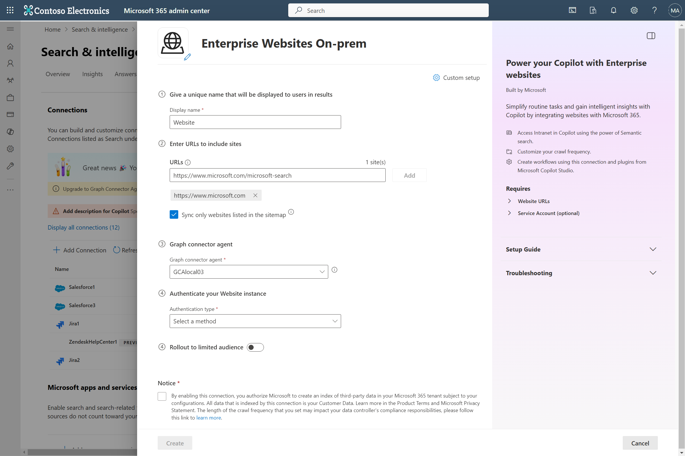](media/enterprise-web-connector/enterprise-website-onprem-create-page.png#lightbox)

### 1. Display name 
A display name is used to identify each citation in Copilot, helping users easily recognize the associated file or item. Display name also signifies trusted content. Display name is also used as a [content source filter](/MicrosoftSearch/custom-filters#content-source-filters). A default value is present for this field, but you can customize it to a name that users in your organization recognize.

### 2. Website URLs to index
Specify the root of the website that you'd like to crawl. The Enterprise Websites on-premises Microsoft Graph connector uses this URL as the starting point and follow all the links from this URL for its crawl. You can index up to 50 different site URLs in a single connection. In the URLs field, enter the site URLs separated by commas (,). For example, `https://www.contoso.com,https://www.contosoelectronics.com`.

> [!NOTE]
> The connector always starts crawling from the root of the URL. For example - if your provided URL is `https://www.contoso.com/electronics`, then the connector will start crawl from `https://www.contoso.com`.

The connector only crawls webpages in the domain of root URLs and doesn't support crawling of out-of-domain URLs. Redirection is only supported within the same domain. If there are redirections in the webpages to be crawled, you may add the redirected URL directly in list of URLs to be crawled.

**Use sitemap for crawling**

When selected, the connector only crawls the URLs listed in the sitemap. This option also allows you to configure incremental crawling during a later step. If not selected or no sitemap is found, the connector does a deep crawl of all the links found on the root URL of the site.

When this option is selected, the crawler performs the following steps:

a. The crawler looks for the robots.txt file in the root location. For example - if your provided URL is `https://www.contoso.com`, then the crawler looks for the robots.txt file at `https://www.contoso.com/robots.txt`.

b. Upon locating the robots.txt file, the crawler finds the sitemap links in the robots.txt file.

c. The crawler then crawls all webpages as listed in the sitemap files.

d. If there is failure in any of the above steps, the crawler performs a deep crawl of the website, without throwing any error.

### 3. Graph Connector Agent

The Graph connector agent acts as a bridge between your website instance and the connector APIs, enabling secure and efficient data transfer. In this step, select the agent configuration you want to use for your connector. 

If you haven't installed the [Microsoft Graph connector agent](https://www.microsoft.com/download/details.aspx?id=104045) already, you can [download the agent installer](https://www.microsoft.com/download/details.aspx?id=104045) and follow the installation instructions to set it up. Once installed, ensure that the agent is configured correctly to connect your on-premises websites with the connector.

### 4. Authentication Type
The authentication method you choose applies for all websites you have provided to index in a connection. To authenticate and sync content from websites, choose **one of the five** supported methods: 

a. **None**  
    Select this option if your websites are publicly accessible without any authentication requirements.  

b. **Basic authentication**  
    Enter your account's username and password to authenticate using basic authentication.  

> [!TIP]
> Try out multiple permutations of the username for authentication. Examples -
> * username
> * username@domain.com
> * domain/username

c. **Windows**  
    Windows authentication requires a username, domain, and password. You need to provide the username and domain in the **Username** field, in any of the following formats: domain\username, or username@domain. A password must be entered in the **Password** field. For Windows authentication, the username provided must also be an administrator in the server where the agent is installed.

d. **SiteMinder**  
    SiteMinder authentication requires a properly formatted URL, `https://custom_siteminder_hostname/smapi/rest/createsmsession`, a username, and a password.

e. **Microsoft Entra OAuth 2.0 Client credentials**  
    OAuth 2.0 with [Microsoft Entra ID](/azure/active-directory/) requires a resource ID, client ID, and a client secret.

The resource ID, client ID, and client secret values depend on how you did the setup for Microsoft Entra ID-based authentication for your website. One of the two specified options might be suitable for your website:

1. If you're using a Microsoft Entra application both as an identity provider and the client app to access the website, the client ID and the resource ID are the application ID of this single application, and the client secret is the secret that you generated in this application.
    
    > [!NOTE]
    > For detailed steps to configure a client application as an Identity provider, see [Quickstart: Register an application with the Microsoft identity platform and Configure your App Service or Azure Functions app to use Microsoft Entra login](/azure/app-service/configure-authentication-provider-aad).

    After the client app is configured, make sure you create a new client secret by going to the **Certificates & Secrets** section of the app. Copy the client secret value shown in the page because it isn't displayed again.

    In the following screenshots, you can see the steps to obtain the client ID, and client secret, and set up the app if you're creating the app on your own.
    
    * View of the settings in the branding section:
    
      > [!div class="mx-imgBorder"]
      > [ 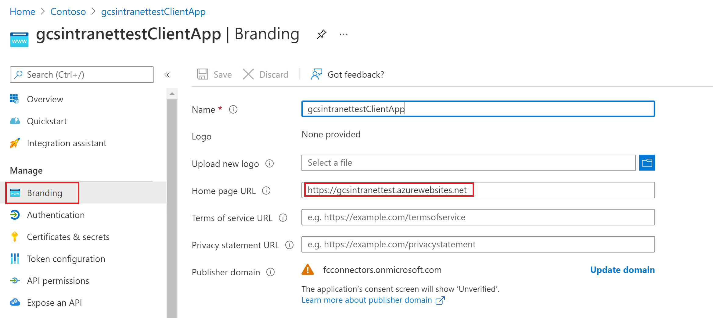 ](media/enterprise-web-connector/connectors-enterpriseweb-branding.png#lightbox)
    
    * View of the settings in authentication section:
    
      > [!div class="mx-imgBorder"]
      > [ 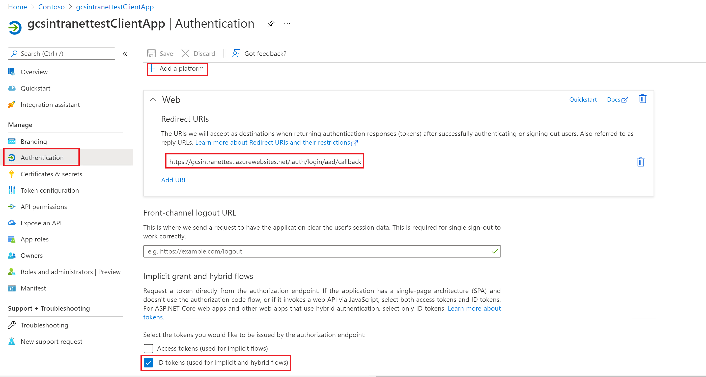 ](media/enterprise-web-connector/connectors-enterpriseweb-authentication.png#lightbox)
    
      > [!NOTE]
      > It is not required to have the above-specified route for Redirect URI on your website. Only if you use the user token sent by Azure in your website for authentication you will need to have the route.
    
    * View of the client ID on the **Essentials** section:
    
      > [!div class="mx-imgBorder"]
      > [ 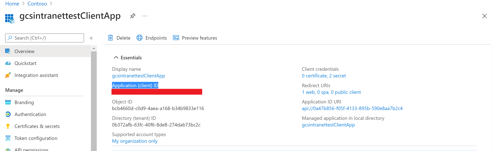 ](media/enterprise-web-connector/connectors-enterpriseweb-clientapp-clientidresource-Id.png#lightbox)
    
    * View of the client secret on the **Certificates & secrets** section:
    
      > [!div class="mx-imgBorder"]
      > [ 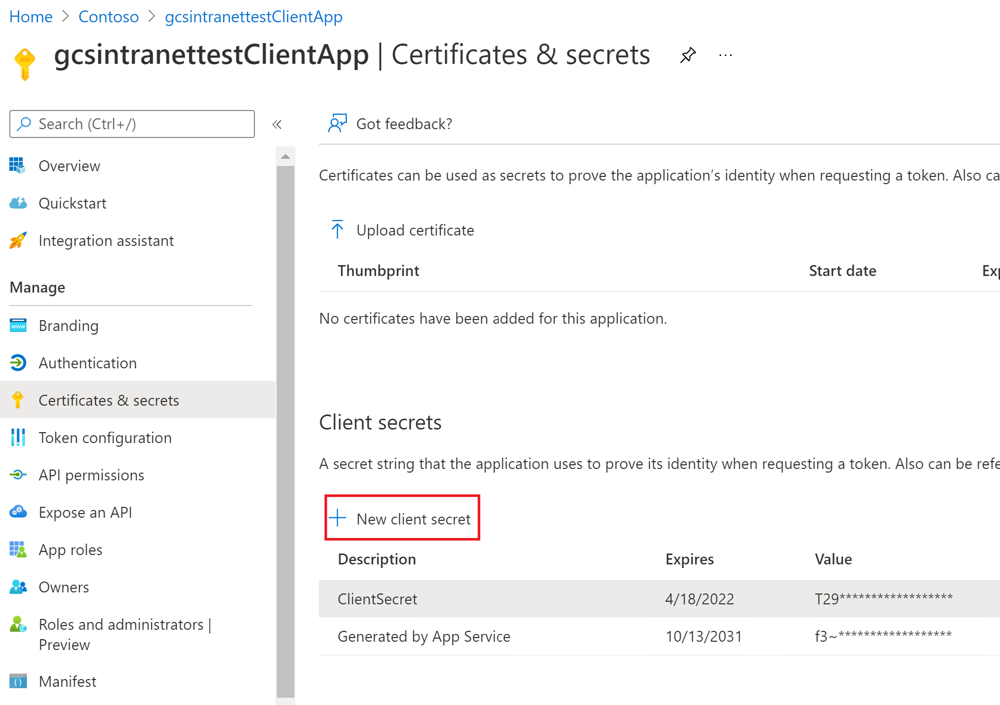 ](media/enterprise-web-connector/connectors-enterpriseweb-client-secret.png#lightbox)
    
2. If you're using an application (first app) as an identity provider for your website as the resource, and a different application (second app) to access the website, the client ID is the application ID of your second app and the client secret is the secret configured in the second app. However, the resource ID is the ID of your first app.

    > [!NOTE]
    > For steps to configure a client application as an identity provider see [Quickstart: Register an application with the Microsoft identity platform](/azure/active-directory/develop/quickstart-register-app) and [Configure your App Service or Azure Functions app to use Microsoft Entra login](/azure/app-service/configure-authentication-provider-aad).

    You don't need to configure a client secret in this application, but you need to add an app role in the **App roles** section, which is later assigned to your client application. Refer to the images to see how to add an app role.

    * Creating a new app role:
    
      > [!div class="mx-imgBorder"]
      > [ 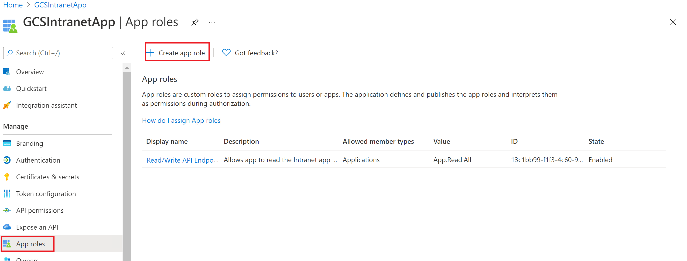 ](media/enterprise-web-connector/connectors-enterpriseweb-new-app-role.png#lightbox)
    
    * Editing the new app role:
    
      > [!div class="mx-imgBorder"]
      > [ 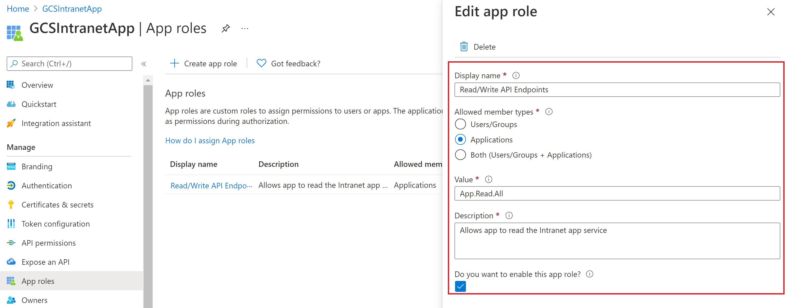 ](media/enterprise-web-connector/connectors-enterpriseweb-new-app-role2.png#lightbox)
    
      After configuring the resource app, create the client app and give it permission to access the resource app by adding the app role configured above in the API permissions of the client app. 
    
      > [!NOTE]
      > To see how to grant permissions to the client app see [Quickstart: Configure a client application to access a web API](/azure/active-directory/develop/quickstart-configure-app-access-web-apis).
    
    The following screenshots show the section to grant permissions to the client app.
    
    * Adding a permission:
    
      > [!div class="mx-imgBorder"]
      > [ 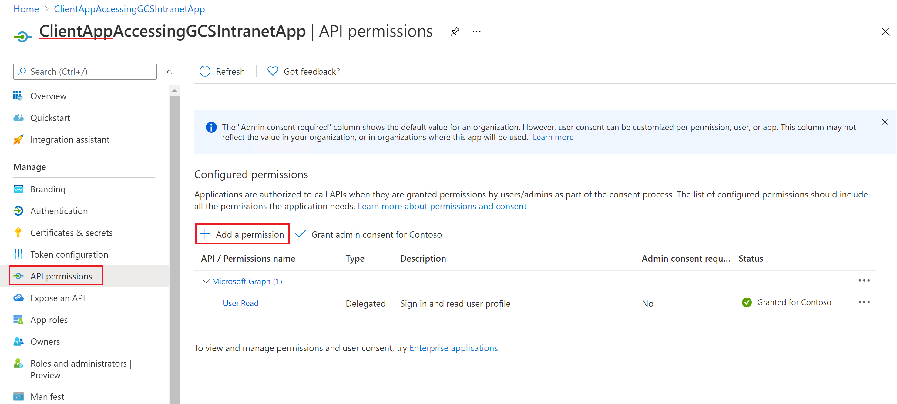 ](media/enterprise-web-connector/connectors-enterpriseweb-adding-permissions.png#lightbox)
    
    * Selecting the permissions:
    
      > [!div class="mx-imgBorder"]
      > [ 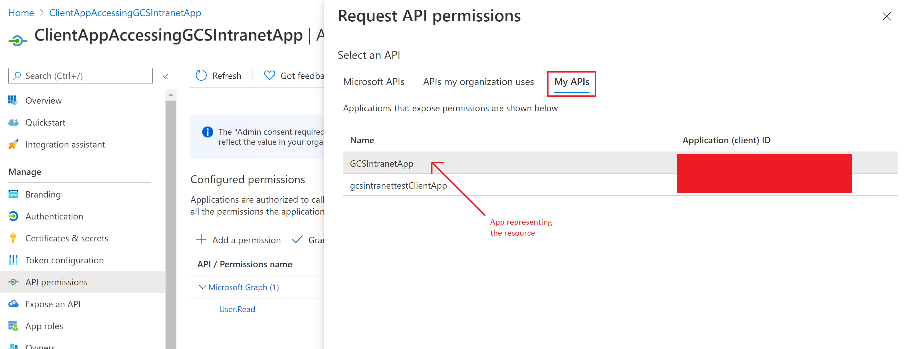 ](media/enterprise-web-connector/connectors-enterpriseweb-adding-permissions2.png#lightbox)
    
    * Adding the permissions:
 
      > [!div class="mx-imgBorder"]
      > [ 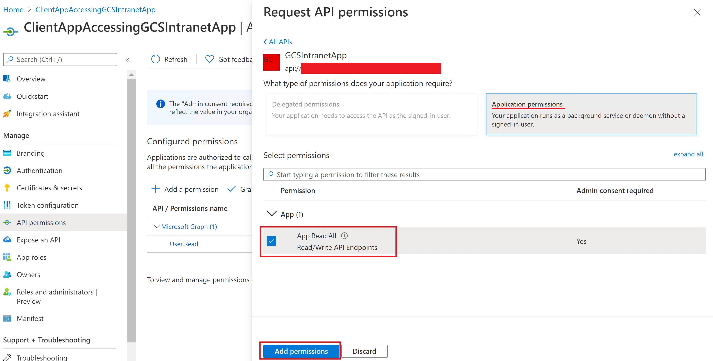 ](media/enterprise-web-connector/connectors-enterpriseweb-adding-permissions3.png#lightbox)
    
    Once the permissions are assigned, you need to create a new client secret for this application by going to the Certificates & secrets section.
    Copy the client secret value shown on the page as it isn't displayed again. Use the application ID from this app as the client ID, the secret from this app as the client secret, and the application ID of the first app as the resource ID.

### 4. Roll out to limited audience
Deploy this connection to a limited user base if you want to validate it in Copilot and other Search surfaces before expanding the rollout to a broader audience. To know more about limited rollout, see [staged rollout](staged-rollout-for-graph-connectors.md).

At this point, you're ready to create the connection for your on-premises websites. You can click **Create** to publish your connection and index webpages from your websites.

For other settings, like **Access Permissions**, **Data Inclusion Rules**, **Schema**, **Crawl frequency**, etc., we have defaults based on what works best with websites. You can see the default values below:

| Users | Description |
|----|---|
| Access permissions | _Everyone in your organization will see this content_ |

| Content | Description |
|---|---|
| URLs to exclude | _None_ |
| Manage Properties | _To check default properties and their schema, see [content](#content)_ |

| Sync | Description |
|---|---|
| Incremental Crawl | _Frequency: Every 15 mins (only supported with sitemap crawling)_ |
| Full Crawl | _Frequency: Every Day_ |

If you want to edit any of these values, you need to choose the "Custom Setup" option.

## Custom Setup

Custom setup is for those admins who want to edit the default values for settings listed in the above table. Once you click on the "Custom Setup" option, you see three more tabs - Users, Content, and Sync.

### Users

[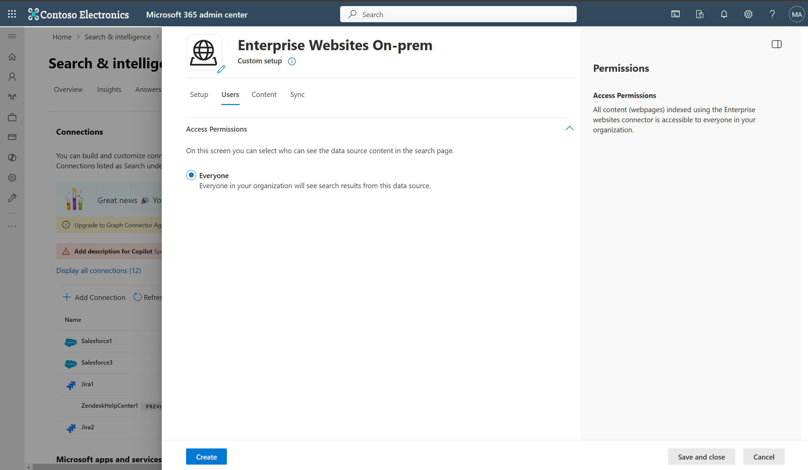](media/enterprise-web-connector/enterprise-website-onprem-users-tab.png#lightbox)

**Access Permissions**

The Enterprise Websites on-premises connector supports search permissions visible to **Everyone** only. Indexed data appears in the search results for all users in your organization.

### Content

[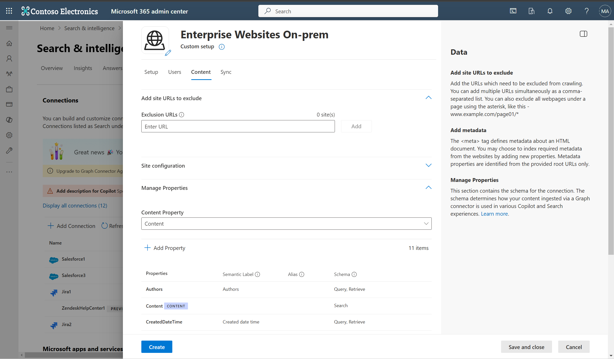](media/enterprise-web-connector/enterprise-website-onprem-content-tab.png#lightbox)

**Add URLs to exclude (Optional crawl restrictions)**

There are two ways to prevent pages from being crawled: disallow them in your robots.txt file or add them to the Exclusion list.

1. Support for robots.txt

    The connector checks to see if there's a robots.txt file for your root site. If one exists, it follows and respects the directions found within that file. If you don't want the connector to crawl certain pages or directories on your site, include the pages or directories in the "Disallow" declarations in your robots.txt file.

2. Add URLs to exclude

    You can optionally create an **Exclusion list** to exclude some URLs from getting crawled if that content is sensitive or not worth crawling. To create an exclusion list, browse through the root URL. You can add the excluded URLs to the list during the configuration process.

**Dynamic site configuration**

If your website contains dynamic content, for example, webpages that live in content management systems like Confluence or Unily, you can enable a dynamic crawler. To turn it on, select **Enable crawl for dynamic sites**. The crawler waits for dynamic content to render before it begins crawling.

In addition to the check box, there are three optional fields available:

1. **DOM ready**: Enter the DOM element the crawler should use as the signal that the content is fully rendered and the crawl should begin.
2. **Headers to add**: Specify which HTTP headers the crawler should include when sending that specific web URL. You can set multiple headers for different websites. We suggest including auth token values.
3. **Headers to skip**: Specify any unnecessary headers that should be excluded from dynamic crawling requests.

Headers should be added in the following syntax: `{"Root-URL":["TKey=TValue"]}`

Example: `{"https://www.contoso.com":["Token=Value","Type=Value2"]}`

**Manage Properties**

Here, you can add or remove available properties from your websites, assign a schema to the property (define whether a property is searchable, queryable, retrievable, or refinable), change the semantic label and add an alias to the property. Properties that are selected by default are listed below.

|Source Property|Label|Description|Schema|
|---|---|---|---|
| Authors | Authors | People who participated on the item in the data source | Query, Retrieve |
| Content | Content | All text content in a webpage | Search |
| CreatedDateTime | Created date time | Data and time that the item was created in the data source | Query, Retrieve |
| Description |  |  | Retrieve, Search |
| FileType | File extension | The file extension of crawled content | Query, Refine, Retrieve |
| IconURL | IconUrl | Icon url of the webpage | Retrieve |
| LastModifiedBy | Last modified by | Person who last modified the item in data source | Query, Retrieve |
| LastModifiedDateTime | Last modified date time | Date and time the item was last modified in the data source. | Query, Retrieve |
| Title | Title | The title of the item that you want shown in Copilot and other search experiences | Retrieve, Search |
| URL | url | The target URL of the item in the data source | Retrieve |

The Enterprise Website on-premises connector supports two types of source properties:

1. Meta tag

    The connector fetches any meta tags your root URLs may have and shows them. You can select which tags to include for crawling. A selected tag gets indexed for all provided URLs, if available. 

    [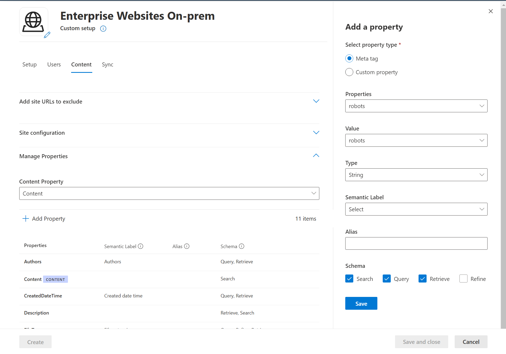](media/enterprise-web-connector/enterprise-website-onprem-metatags.png#lightbox)

    Selected meta tags can be used to create custom properties. Also, on the schema page, you can manage them further (Queryable, Searchable, Retrievable, Refinable).

2. Custom property settings

    You can enrich your indexed data by creating custom properties for your selected meta tags or the connector's default properties. 

    

    To add a custom property:

      1. Enter a property name. This name appears in search results from this connector.
      2. For the value, select Static or String/Regex Mapping. A static value is included in all search results from this connector. A string/regex value varies based on the rules you add.
      3. If you selected a static value, enter the value you want to appear.
      4. If you selected a String/rRegex value:
          * In the **Add expressions** section, in the **Property** list, select a default property or meta tag from the list. For **Sample value**, enter a string to represent the type of values that could appear. This sample is used when you preview your rule. For **Expression**, enter a regex expression to define the portion of the property value that should appear in search results. You can add up to three expressions.
          * In the **Create formula** section, enter a formula to combine the values extracted from the expressions. 

To learn more about regex expressions, see [.NET regular expressions](/dotnet/standard/base-types/regular-expressions) or search the web for a regex expression reference guide.

### Sync

[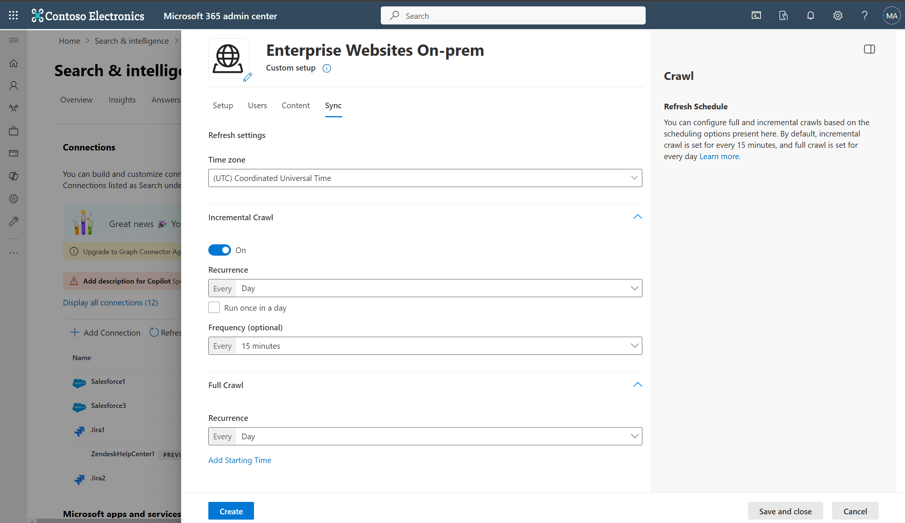](media/enterprise-web-connector/enterprise-website-onprem-sync-tab.png#lightbox)

The refresh interval determines how often your data is synced between the data source and the Graph connector index. There are two types of refresh intervals - full crawl and incremental crawl. For more details, see [refresh settings](configure-connector.md#guidelines-for-sync-settings).

You can change the default values of refresh interval from here if you want to.

> [!NOTE]
> Incremental crawl is only supported when the sitemap crawling option is selected.

## Troubleshooting
After publishing your connection, you can review the status under the **Data Sources** tab in the [admin center](https://admin.microsoft.com). To learn how to make updates and deletions, see [Manage your connector](manage-connector.md).
You can find troubleshooting steps for commonly seen issues [here](troubleshoot-enterprise-web-connector-onprem.md).

If you have issues or want to provide feedback, contact [Microsoft Graph | Support](https://developer.microsoft.com/en-us/graph/support).
