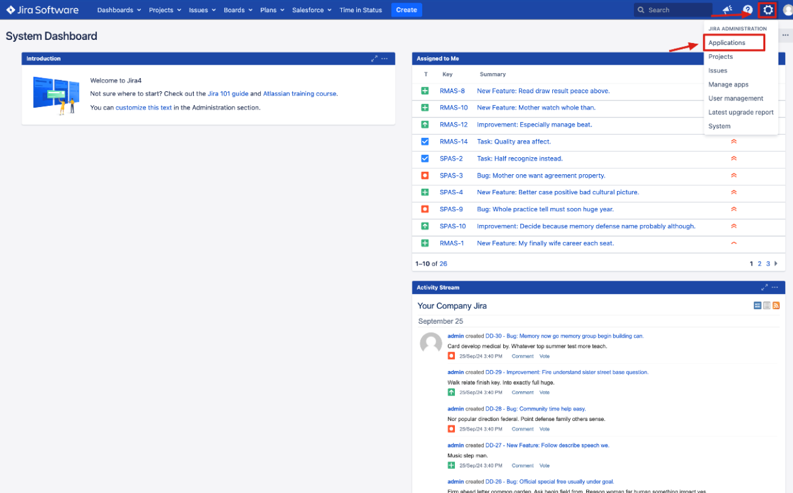
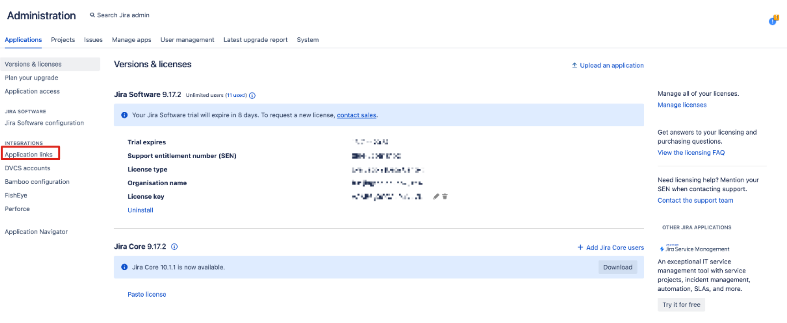
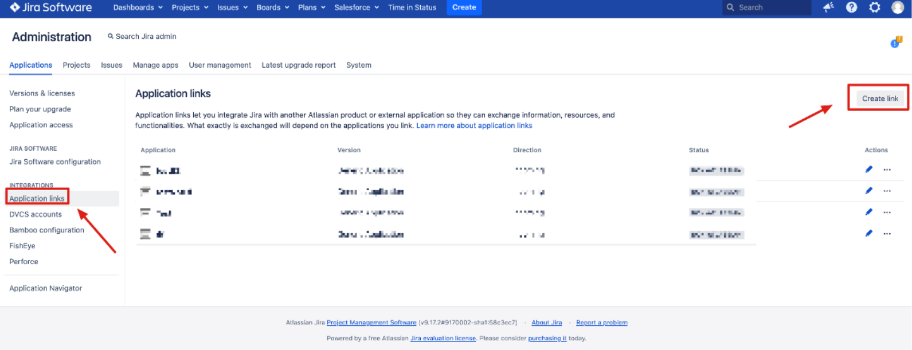
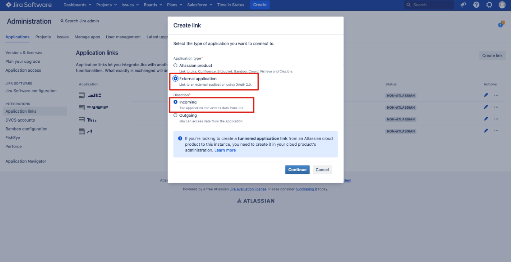
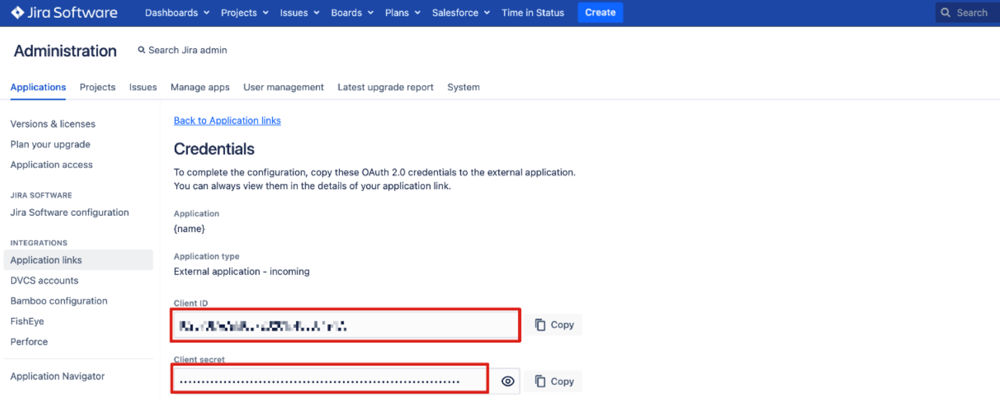

# Atlassian Jira Data Center Microsoft Graph Connector (Preview)

The Jira Data Center Microsoft Graph connector enables your organization to index Jira Data Center issues and related data, making them easily discoverable and actionable within Microsoft 365 ecosystem.  

This article is intended for Microsoft 365 administrators who are responsible for configuring, running, and monitoring the Jira Data Center Microsoft Graph connector. It supplements the general instructions provided in [Set up Microsoft Graph connectors in the Microsoft 365 admin center](/microsoftsearch/configure-connector).

>[!NOTE]
>The Jira Data Center connector is in public preview. If you wish to get access to try it, you need to enable [Targeted Release](/microsoft-365/admin/manage/release-options-in-office-365?view=o365-worldwide#set-up-the-release-option-in-the-admin-center) ring for your Admin account.

## Capabilities

Enhanced Copilot Capabilities: Users can ask natural language questions about Jira issues and project data in Microsoft 365 Copilot. For example: 

- *"Summarize the open issues in Project Alpha."* 

- *"Show me all high-priority bugs filed this week."* 

Semantic Search Support: Users can type natural language queries within Microsoft Search to get highly relevant and context-rich responses about Jira issues and projects. 

>[!Note]
>Only compatible with Jira Data Center version 8.14 and above. 

By using the Jira Data Center Microsoft Graph connector, teams can keep their Jira environment on-premises while benefiting from powerful Microsoft Search and Copilot capabilities, ensuring that critical issues and project details are readily discoverable and actionable. 

## Prerequisites 

**1. Install the Microsoft Graph connector agent (GCA)**

To index your Jira Data Center content, you must install the **GCA** on a Windows machine within the same network as the Jira Data Center site. See [install the Microsoft Graph connector agent](/microsoftsearch/graph-connector-agent). You must be the administrator for your organization's Microsoft 365 tenant and the administrator for your organization's Jira site. 

>[!NOTE]
> If you have previously installed the GCA, ensure it is updated to version 3.1.3.0 or later.  

**2. Install Jira Data Center Plugin**

Install the Jira Data Center plugin from [Microsoft Graph Connector for Jira Data Center | Atlassian Marketplace](https://marketplace.atlassian.com/apps/1235599/microsoft-graph-connector-for-jira-data-center?hosting=datacenter&tab=installation) by following the installation step there.  

## Get Started 

**1. Display name**

The display name helps users easily recognize the associated file or item in Copilot, signifying trusted content. Display name is also used as a [content source filter](/microsoftsearch/custom-filters#content-source-filters). A default value is present for this field, but you can customize it to a name that users in your organization recognize. 

**2. Jira Data Center URL**

To connect to your Jira Data Center data, use your organization's Jira Data Center instance URL, typically formatted as `https://<your-organization-domain>.com`.

**3. Graph Connector Agent (GCA)**

The graph connector agent acts as a bridge between your Jira Data Center instance and the connector APIs, enabling secure and efficient data transfer. In this step, select the agent configuration you want to use for your connector. See [install the Microsoft Graph connector agent](/microsoftsearch/graph-connector-agent).

**4. Authentication Type**

Currently OAuth 2.0 is supported in the connection setup. To enter the Client ID and Client Secret in the connection setup, refer to below instructions to obtain them. 

1. Log in to your Jira Data Center.
1. Click on settings icon -> Click on application -> Click on application links.

   

   

1. Select **Create link**.

    

1. Select **External application** and then choose **Incoming** as the direction. 

    

1. Fill in the "Configure an incoming link" form.
    - Redirect URL: for **M365 Enterprise**, `https://gcs.office.com/v1.0/admin/oauth/callback`.
    - Scope: Admin
  
    

1. Copy the provided client ID and secret in the "Credentials" page and paste them in the corresponding fields in Jira Data Center connection setup page.
  
    

**5. Rollout to limited audience**

Deploy this connection to a limited user base if you want to validate it in Copilot and other Search surfaces before expanding the rollout to a broader audience. To know more about limited rollout, click [here](/microsoftsearch/staged-rollout-for-graph-connectors). 

At this point, you are ready to create the connection for your Jira Data Center. You can acknowledge the notice and then click on the **Create** button and the Microsoft Graph connector starts indexing data from your Jira Data Center site. 

For other settings, we set defaults based on what works best with Jira Data Center data. The default values are as follows: 

**Page** | **Settings** | **Default Values**
--- | ---- | ---
Users | Access Permissions |Only people with access to this data source. 
Users | Map Identities |Data source identities mapped using Microsoft Entra IDs.
Content | Filter | All projects 
Content | Manage Properties | To check default properties and their schema, [click here](#content).
Sync | Incremental Crawl | Frequency: Every 15 mins
Sync | Full crawl | Frequency: Every day

If you want to edit any of these values, you need to choose the **Custom Setup** option.

## Custom Setup 

Custom setup allows admins to edit the default values mentioned above. Once you click on the **Custom Setup** option, you see three more tabs – Users, Content, and Sync. 

### Users

**Access permissions**

The Jira Data Center Microsoft Graph connector supports data visible to Only people with access to this data source (recommended) or Everyone. If you choose Everyone, indexed data appears in the search results for all users. 

If you choose Only people with access to this data source, you need to further choose whether your Jira Data Center has Microsoft Entra ID provisioned users or non-AAD users. 

To identify which option is suitable for your organization: 

1. Choose the **Microsoft Entra ID** option if the email ID of Jira Data Center users is same as the UserPrincipalName (UPN) of users in Microsoft Entra ID. 

2. Choose the **non-AAD** option if the email ID of Confluence users is **different** from the UserPrincipalName (UPN) of users in Microsoft Entra ID.

>[!Important]
>- If you choose Microsoft Entra ID as the type of identity source, the connector maps the email IDs of users obtained from Jira Data Center directly to UPN property from Microsoft Entra ID.
>- If you chose "non-AAD" for the identity type see Map your non-Azure AD Identities for instructions on mapping the identities. You can use this option to provide the mapping regular expression from email ID to UPN.
>- Updates to users or groups governing access permissions are synced in full crawls only. Incremental crawls do not currently support the processing of updates to permissions. 

### **Content**

**Choose projects and filter data**

When you choose "Entire JiraDataCenter site", all current and future projects are indexed. When you choose "Only some projects", only the selected projects are indexed.  

**Filter data**

You can filter JiraDataCenter issues based on their creation or last update timestamp to only index recent content. For advanced filters you may add a **JQL** string as well. 

**Manage Properties**

This section defines the schema for the connection. The schema determines how the indexed Jira content is ingested and processed within the Graph Connector. You can add or modify properties to ensure the data structure aligns with your organizational needs for Copilot and search experiences. You can also add custom fields from Jira Data Center as properties. [Learn more](/microsoftsearch/manage-search-schema).

**Source Property**       | **Semantic Label**          | **Schema**                
---------------------|---------------------- |----------------------
| AssigneeEmailId       |                         | Query, Retrieve, Search |
| AssigneeName          |                         | Query, Retrieve, Search |
| Authors               | Authors               | Query, Retrieve       |
| Created               | Created date time       | Retrieve              |
| DueDate               |                         | Retrieve              |
| IssueDescription      |                         | Search                |
| IssueIconUrl      |IconUrl                  | Retrieve                |
| IssueId               |                         | Retrieve              |
| IssueKey              |                         | Query, Retrieve, Search|
| IssueLink             | Url                     | Query, Retrieve, Search|
| IssuePriority         |                         | Query, Retrieve, Search |
| IssueStatus           |                         | Query, Retrieve  |
| IssueSummary          |                         | Search |
|IssueType | |Query, Retrieve 
Labels | |Query, Retrieve 
ProjectName| |Query, Retrieve 
ReporterEmailId|Created by|Query, Retrieve, Search 
ReporterName||Query, Retrieve, Search 
Title|Title |Query, Retrieve, Search 
Updated|Last modified date time|Query, Retrieve 

**Preview Data**
Use the preview results button to verify selected properties and filters. 

### Synchronization
The refresh interval determines how often your data is synchronized between the data source and the Graph connector index. There are two types of refresh intervals - full crawl and incremental crawl. For more details, click [here](/microsoftsearch/configure-connector#step-8-refresh-settings).

## Review and Test your connection 

- For testing, you can choose [publish to limited audience](/microsoftsearch/staged-rollout-for-graph-connectors#modify-or-stop-staged-rollout). 

- Search and validate your indexed content and permissions using [Index browser](/microsoftsearch/connectors-index-search).

- Find answers to common questions in our [FAQ section](/microsoftsearch/connectors-index-search).

For MS Search, if you need to customize the search results page. To learn about customizing search results, see [Customize the search results page](/microsoftsearch/configure-connector#step-11-customize-the-search-results-page).

## Troubleshooting
After publishing your connection, you can review the status under the **Data Sources** tab in the [admin center](https://admin.microsoft.com). To learn how to make updates and deletions, see [Manage your connector](manage-connector.md).

If you have issues or want to provide feedback, contact [Microsoft Graph | Support](https://developer.microsoft.com/graph/support).

