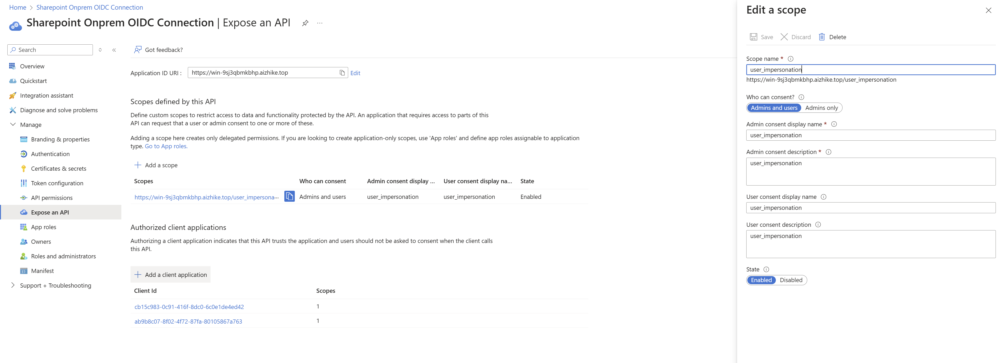
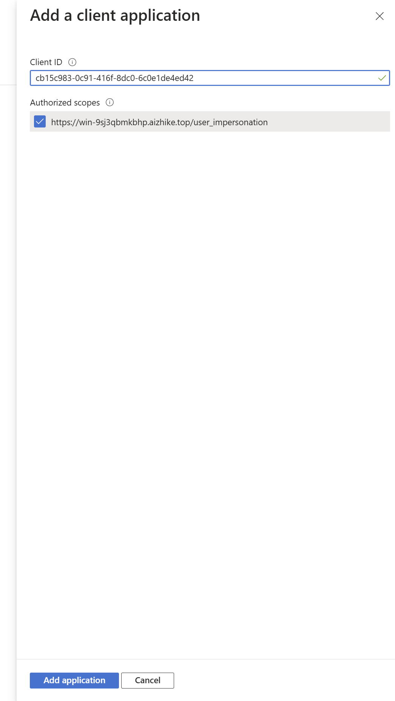

# SharePoint Server Microsoft Graph connector

SharePoint server graph connector allows users in your organization to search for content stored in on-premises SharePoint server or use the content in Copilot for specific use cases and scenarios. It crawls over Documents and site pages from the on-premises instance.

> [!NOTE]
> Active directory synchronization is a pre-requisite for enabling security trimming in SharePoint Server content search.

## Capabilities

- Uses the authenticated account to crawl SharePoint documents and web-pages along with permissions.
- Users that don't have permissions on the items don't find the item in their Search or Copilot results.
- Lists all available site collections available that the users can choose to include for indexing.
- Use exclusion feature to exclude sites from indexing.
- Enable users to utilize connector content for Copilot queries and prompts. Here are some of capabilities:
  - Ask questions around the content of the documents. Example, What is the current sales projections mentioned in the file *Sales_Report.doc*.
  - Summarize the content of documents. Example, summarize the file *Sales_Report.doc*.
  - Create content using existing documents. Example, Create a FAQs document to be shared with sales personnel using file *Sales_Report.doc*.

## Limitations

- The connector only supports documents and web-pages.
- The exclusion rules exclude only the sites and not the content type inside a site.

## Before you get started

### Install the Graph connector agent

To index your SharePoint on-premises content, you must install and register Graph Connector Agent. See [Install Graph Connector Agent](graph-connector-agent.md) to learn more. Graph Connector Agent can be installed on the same machine as the SharePoint server or on a machine which has access to the SharePoint on-premises server.

Each source (SharePoint web application) can be configured in one connection. One Graph Connector Agent can be used to source content from multiple connections of SharePoint on-premises sources. It's advised to limit the number of connections to an agent to three sources, to ensure an optimal ingestion rate.

User should have full control access to the SharePoint server or should be a farm admin. Items which the user doesn't have permission are skipped.

## Mandatory and optional settings

To get you quickly started with Microsoft Graph connectors, the steps in the setup process are split into two groups:

**Mandatory settings** - Default setup screen that you see when you enter the setup flow. You must provide inputs for these fields to create the connection. The inputs (connection name, data source settings, etc.) vary based on your organization's context and use case.

**Custom Setup (optional settings)** - Custom setup has advanced configuration steps for super users. The steps are optional and for your convenience, the settings in the setup process are pre-configured with default values based on the most common selections made by admins. You can choose to accept the default values or modify them to suit your organization's needs.

## Get started

[Add the SharePoint Server Microsoft Graph connector](https://admin.microsoft.com/adminportal/home#/MicrosoftSearch/Connectors/add).

For more information, see general [setup instructions](./configure-connector.md).

.

### 1. Display name

A display name is a user facing name in Copilot. Choose the right display name for your users to identify with the content of the data source. The name is also useful for the users who wish to add Graph connectors knowledge in their Copilot Agents. Display name also signifies trusted content. Display name is also used as a [content source filter](/MicrosoftSearch/custom-filters#content-source-filters). A default value is present for this field, but you can customize it to a name that users in your organization recognize.

### 2. SharePoint Instance Url

Enter the URL for SharePoint site/site collection in the format https://\{domain}/sites/{site-name}. The connector identifies the site url and lists all site collections present in that web application. Admins can choose from these site collections to index the content.

### 3. Select Graph Connector Agent

Select from the list of available Graph Connector Agents registered to your tenant.

### 4. Authentication

Choose the authentication type from the drop-down menu of options. Currently supported options are Basic, Windows and Microsoft Entra ID.

> [!NOTE]
> Use Domain\username format in username to authenticate to the SharePoint server instance using the Windows option.

To authenticate with the provided credentials, you need to click on Sign-in to load the list of available site collections.

#### Microsoft Entra ID based authentication for Microsoft SharePoint Server Graph Connector

Before using Entra ID based authentication method, ensure the following prerequisites are met:

- Microsoft Entra ID based authentication is supported for Graph Connector Agent versions 3.1.2.0 and above. Upgrade your agent before proceeding. See [Install Graph Connector Agent](graph-connector-agent.md) to learn more.
- Microsoft Entra ID based authentication is supported only for SharePoint Server Edition. Take the path released in November 2024 (patch 16.0.17928.20238) or later from [SharePoint Updates](/officeupdates/sharepoint-updates).
- You'll need to set up OpenID Connect (OIDC) with Microsoft Entra ID. Hence, ensure that SharePoint must use HTTPS as OpenID Connect (OIDC) step requires HTTPS.

##### Steps

1. [Download](https://www.microsoft.com/download/details.aspx?id=47594) Microsoft Entra ID Connect.
1. Follow [steps](/entra/identity/hybrid/connect/how-to-connect-install-roadmap) to install Microsoft Entra ID Connect.
1. Set up and enable OpenID Connect (OIDC) with Microsoft Entra ID using the steps [here](/sharepoint/security-for-sharepoint-server/set-up-oidc-auth-in-sharepoint-server-with-msaad). This step will require you to set up third party application in your Azure portal. Ensure that you have admin rights to perform this step.

###### Configure "Expose an API"

- Go to "Expose an API" tab from the left hand navigation pane. Make sure the application ID uri matches your sharepoint server URL.

  

- Click "Add a scope", enter user_impersonation for scope name, admin consent display name, and admin consent description.
- Click "Add a client application", enter GCA's client id cb15c983-0c91-416f-8dc0-6c0e1de4ed42

  

- Check user_impersonation scope.

### 5. Select Site Collections

Select which site collections you want to index. The site collections belong to the web application that we identify from the SharePoint url provided. This list can be long based on the number of site-collections available in the data source.

### 6. Roll out to limited audience

Deploy this connection to a limited user base if you want to validate it in Copilot and other Search surfaces before expanding the rollout to a broader audience. To know more about limited rollout, see [staged rollout](staged-rollout-for-graph-connectors.md).

At this point, you're ready to create the connection for SharePoint. You can click **Create** to publish your connection and index the selected content.

For other settings, like **Access Permissions**, **Data Exclusion Rules**, **Schema**, **Crawl frequency**, etc., we have defaults based on what works best with Jira data.

### 7. Successful Create

Once the connection creation is successful, it starts syncing the content. At this time, admins are asked to provide a description for the connection. The description helps Copilot discover the connection content better. The better the connection description for the intended content usage, the better would be Copilot responses. The description is also useful for users to select the right connection for their Declarative Agents.

## Custom Set up

Custom set up is for those admins who want to edit the default values for settings. Once you click on the "Custom Set up" option, you see three more tabs - Users, Content, and Sync.

If you edit any connection, it always opens in a custom set up window.

### Users

The below options are available.

| Users | Description |
|----|---|
| Access permissions | _Only people with access to content in Data source can see the content.(Recommended)._ |
| Everyone | _The connection is open to everyone and anyone in your organization can see the content._ |

> [!NOTE]
> Graph Connectors support Users, Security Groups and Distribution Lists. However, the data source (SharePoint Server) does not support Distribution Lists as Access Control Lists. If there are nested distribution lists, members of those distribution lists may also get access to content through Graph connectors.

The default and preferred option is the one where connector honors the data source permissions and only allowed users can see the results. You're free to change it to "Everyone" if you want to make it available for everyone in the organization.

The SharePoint on-premises connector supports existing Access Controlled List on given items. Indexed data appears in the search results and is visible to users who have permission to view it. Microsoft 365 experiences understand and honor Entra Id permissions. To support Access Controlled Lists on items, we require that Active Directory identities and Entra Identities are synced.

### Content

#### Add site urls to exclude from indexing

Add the URLs of the sites you want to exclude from indexing. Exclusion rules work at the site or sub-site level. Add site URLs to exclude them from crawling. Don't add URLs of site contents. If the URL contains site contents such as documents, it isn't honored. To exclude all site contents or sub-sites that start from these URLs, use * at the end of the URL.

If the URL ends with /\*, then all URLs prefixed with this URL are excluded from crawl. Example, abc.com/private/* excludes abc.com/private/terms.html and all content inside "/private". But, if you provide abc.com/private/terms.html as the URL to exclude, it is not honored as exclusion rules work at site or sub-site level.

#### Manage Properties

Properties define what data is available for searching, querying, retrieving and refining. From these settings you can add or remove data source properties, assign a schema to the property (define whether a property is searchable, queryable, retrievable, or refinable), change the semantic label and add an alias to the property.

|Source Property|Label|Description|Schema|
|---|---|---|---|
| Content | | This is to index the content | Search |
| CreatedBy | Created by | The owner who created the item | Query, Retrieve, Search |
| CreatedByUpn | | The User Principal Name(UPN) of the owner who created the item | Query, Retrieve, Search |
| CreatedTime | Created date time | Data and time that the item was created in the data source | Query, Retrieve |
| DocumentType | | The type of document | Retrieve |
| IcnUrl | IconUrl | Icon url that you want that item type to assign | Retrieve |
| LastAccessed | | Data and time that the item was last accessed | Query, Retrieve |
| LastModified | Last modified date time | Data and time that the item was last modified | Query, Retrieve |
| LastModifiedBy | Created by | The user who modified the item | Query, Retrieve |
| LastModifiedByUpn | | The User Principal Name(UPN) of the user who modified the item | Retrieve, Search |
| Name | Title | The title of the item that you want to show in Copilot and other search experiences | Query, Retrieve, Search |
| ObjectType | | The type of object as returned from the data source | Query, Retrieve, Search |
| Url | | Item url | Retrieve |

You can add custom properties defined in your sites to better manage the search or Copilot outcomes for your users. To add the custom property, click "Add Property" where you need to specify the exact string from the data source. To configure a custom property, you define a property name and specify a data type (String, StringCollection, DateTime, Boolean, Int64, and Double). Custom properties match the custom columns in SharePoint. Be careful when specifying property names as the connector ignores any property names that don't match with any existing properties during crawling. To avoid any issues, double check property names to ensure they're spelled correctly.

> [!NOTE]
> Currently a total of 128 properties are supported. If you are selecting multiple site collections in a single connection, only default properties are supported. If you want to support custom properties defined in a site, create a different connection and add custom properties for that site.

### Sync

The refresh interval determines how often your data is synced between the data source and the Graph connector index. There are two types of refresh intervals - full crawl and incremental crawl. For more information, see [refresh settings](configure-connector.md#guidelines-for-sync-settings).

Default values of refresh interval:

| Sync | Description |
|---|---|
| Incremental Crawl | _Frequency: Every 15 mins_ |
| Full Crawl | _Frequency: Every Day_ |

### Set up search result page

After creating the connection, you need to customize the search results page with verticals and result types. To learn about customizing search results, review how to [manage verticals](manage-verticals.md) and [result types](manage-result-types.md).
